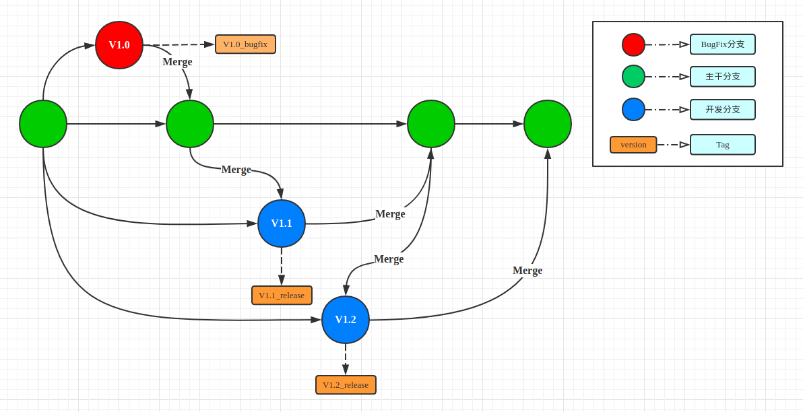

[TOC]

### 流程图


> 多分支并行开发+bug修复分支流程

### 操作流程
> V1.1 + V1.2 并行开发，V1.1先于V1.2上线，开发过程中需要紧急修复V1.0版本的一个BUG

#### V1.1分支开发
```
# 基于master 创建新分支
git checkout -b v1.1
# 功能开发
# 推送到远程分支
git push origin v1.1
```

#### V1.0_bugfix 分支
```
# 基于master 创建新分支
git checkout -b v1.0_bugfix
# 功能开发
# 推送到远程分支
git push origin v1.0_bugfix
# 打包测试，发布上线
# 打tag
git tag -a v1.0_bugfix_201706101020 -m "补锅"
git push --tags
# 合并分支
git checkout master
git merge v1.0_bugfix
git push origin master
# 删除分支
git branch -D v1.0_bugfix
git push origin --delete v1.0_bugfix
```

#### 合并bugfix分支的修改
```
git pull origin master
git pull origin v1.1
git checkout v1.1
git merge master
git push origin v1.1
```

#### V1.1分支继续开发
```
git add -A
git commit -m "dfg又开发了feature"
git push origin v1.1
# 打包测试，发布上线
# 打tag
git tag -a v1.1_201706101349 -m "上线"
git push --tags
# 合并分支
git checkout master
git merge v1.1
git push origin master
# 删除分支
git branch -D v1.1
git push origin --delete v1.1
```


### 附录

#### Github
[GitHub Standard Fork & Pull Request Workflow](https://gist.github.com/Chaser324/ce0505fbed06b947d962)
